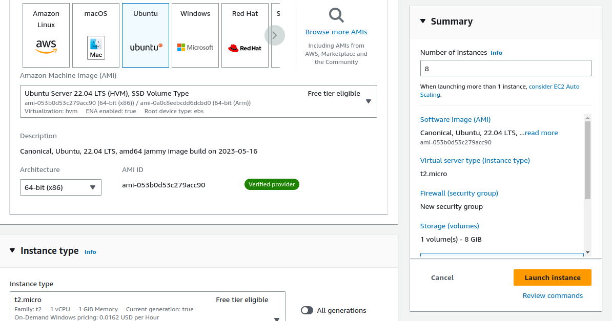
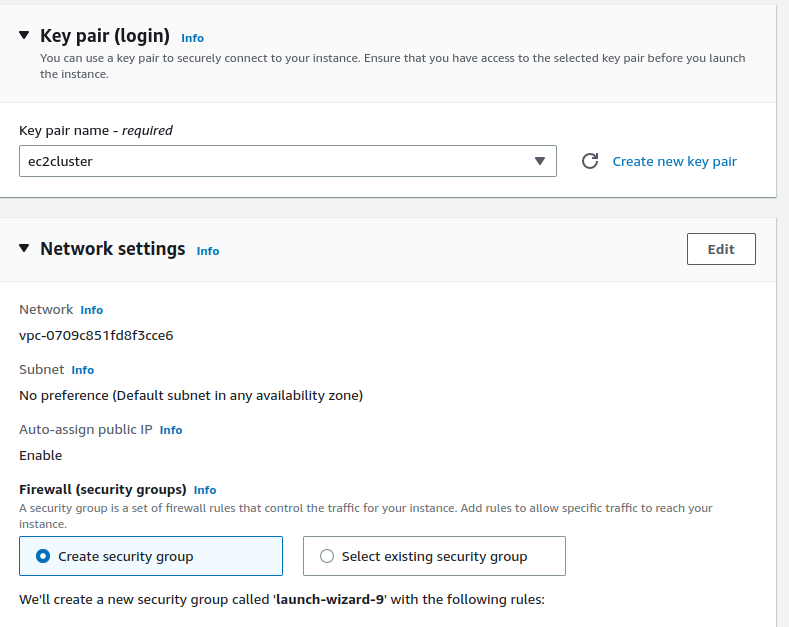
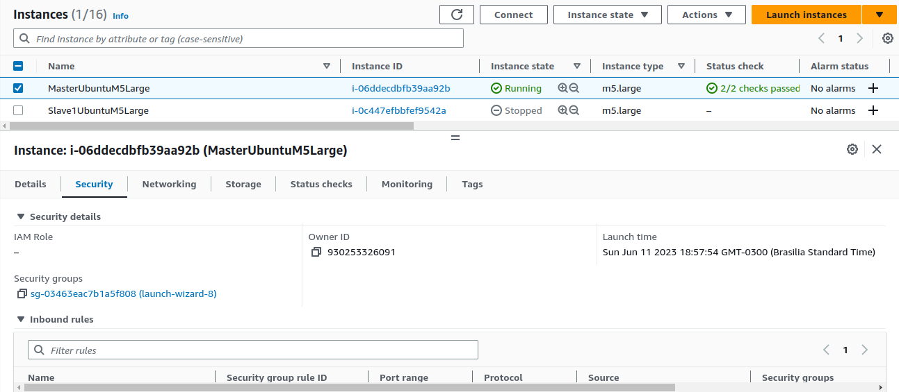
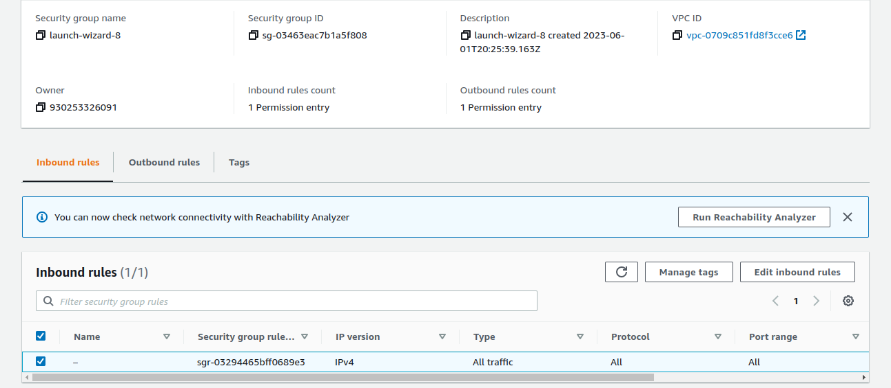
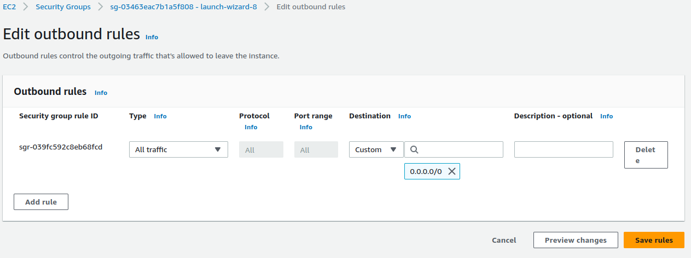

## Configuração do cluster
1. Criar instancias na AWS dentro da mesma VPC e mesmo Security Group (No trabalho são criadas 8)
   1. Escolher um tipo de instancia, preferecialmente as instancias M ou as que focam em processamento para evitar perca de performance durante os testes
   
   2. Selecionar ou criar um key pair que será usado posteriomente para conectar via SSH ao cluster
   
2. Configurar o security group para permitir todos tipos de conexões, TCP e SSH, de toda as origens
   1. Isso é necessário pois o MPI precisa de TCP e SSH para funcionar
   2. Acessar o security group das instancias clicando no nome dela 
   
   3. Clicar editar as outbounds e inbounds rules
   
   4. Configurar para aceitar todos os trafegos, conforme abaixo
   
3. Definir uma das instancias como Master (Somente nome para simplificar)
4. Acessar a instacia master por SSH e configurar o SSH para que ela tenha acesso a todas as outras instancias do cluster.
    `ssh -i ~/Documents/ec2/ec2cluster.pem ubuntu@54.90.170.65`
   1. Importar o certificado para a instancia Master
        `scp -i /home/deivid/Documents/ec2/ec2cluster.pem ec2cluster.pem ubuntu@18.234.84.140:~`
   2. Adicionar o certificado copiado na lista de SSH permitidos da maquina master
        `` eval `ssh-agent -s` ``
        `` ssh-add ~/.ssh/ec2cluster.pem ``
   3. Testar uma conexão SSH e Ping todas as outras maquinas do cluster a partir master 
      1. Sem apontar para o certificado
      2. Utilizar IP interno (privado) da AWS
        `ssh ubuntu@172.90.170.65`
        `ping 172.90.170.65`
   4. Configurar o arquivo /etc/hosts com todos os IP's internos dos Nodes da AWS
      1. Dessa forma é possível fazer SSH diretamente para os nomes e não para os IP's, necessário para o MPI
        ```
        ubuntu@ip-172-31-18-113:~$ cat /etc/hosts
        127.0.0.1 localhost
        172.31.24.112 slave01
        172.31.22.118 slave02
        172.31.19.163 slave03
        172.31.23.168 slave04
        172.31.24.150 slave05
        172.31.30.63 slave06
        172.31.25.57 slave07
        ```
      2. Testar novamente o SSH, diretamente para o nome 
        `ssh slave01`
5. Instalar o MPI em todas as instancias
   ` apt -y update && apt -y install wget build-essential openmpi-bin openmpi-common openmpi-doc libopenmpi-dev libgomp1 `
   1. Testar o funcionamento do MPI
    `mpirun -host slave01, slave02 hostname`
    Deve retornar os IPs dos slaves, caso demore, existe algum erro na configuração (Teste o SSH e o Ping novamente)
6. Instalar o Singularity em todas as instancias
   1. Seguir os passos abaixo do readme
7. Copiar os programas que vão executar para todas as instancias, a partir da sua maquina local
   1. usando o comando SCP é possível copiar os programas para dentro das istâncias 
      1. Necessário copiar os arquivos instancia por instancia
    `scp -i /home/deivid/Documents/ec2/ec2cluster.pem arquivo1 arquivo2 arquivo3 ubuntu@18.234.84.140:~`
   2. Para o MPI funcionar, os programas precisam estar em TODOS os nós do cluster .
8. Criar o Arquivo hostile para definir quantos processadores existem em cada maquina
    ```
    ubuntu@ip-172-31-18-113:~$ cat mpi_hostfile 
    localhost slots=2
    slave01 slots=2
    slave02 slots=2
    slave03 slots=2
    slave04 slots=2
    slave05 slots=2
    slave06 slots=2
    slave07 slots=2
    ```
9.  Executar o MPI com e sem o singularity
    1. Com Singularity:
    `mpirun -np 16 --hostfile mpi_hostfile singularity exec nas-mpi-suite-singularity.sif /is.C.x`
    2. Nativo
    `mpirun -np 16 --hostfile mpi_hostfile nas-mpi-suite-singularity.sif /is.C.x`
10. Para rodar os testes exatamente como os utilizados no artigo, basta copiar os arquivos todos os nós e copiar o arquivo `tests-executor/main.py` para o master node.
    1.  Para executar basta rodar o comando na master 
        `python3 -u main.py /path/to/benchmarks  path/to/singularity-image.sif mpi_hostfile | tee -a output.txt`
    <br>
    Exemplo: `python3 -u main.py /home/ubuntu/bin nas-mpi-suite-singularity.sif mpi_hostfile | tee -a output.txt`
    2. O output é colocado automaticamente um arquivo chamado result.csv que pode ser usado para gerar o graficos no jupyter notebook da pasta `data-analysis`
    3. É possível editar quais benchmarks serão executadas no proprio arquivo `tests-executor/main.py`

## Passos para instalar o Singularity 3.11.1 no Ubuntu do zero

### Instalação
```
sudo apt update && sudo apt install -y \
    build-essential \
    uuid-dev \
    libgpgme-dev \
    squashfs-tools \
    libseccomp-dev pkg-config squashfs-tools cryptsetup \
    wget \
    pkg-config \
    git \
    cryptsetup-bin \
    curl \
    libglib2.0-dev
    
# sudo rm -r /usr/local/go Only if go is already installed

export VERSION=1.19 OS=linux ARCH=amd64  # change this as you need

wget -O /tmp/go${VERSION}.${OS}-${ARCH}.tar.gz https://dl.google.com/go/go${VERSION}.${OS}-${ARCH}.tar.gz && \
sudo tar -C /usr/local -xzf /tmp/go${VERSION}.${OS}-${ARCH}.tar.gz

echo 'export GOPATH=${HOME}/go' >> ~/.bashrc && \
echo 'export PATH=/usr/local/go/bin:${PATH}:${GOPATH}/bin' >> ~/.bashrc && \
source ~/.bashrc

curl -sfL https://install.goreleaser.com/github.com/golangci/golangci-lint.sh |
sh -s -- -b $(go env GOPATH)/bin v1.21.0

mkdir -p ${GOPATH}/src/github.com/sylabs && \
cd ${GOPATH}/src/github.com/sylabs && \
git clone https://github.com/sylabs/singularity.git && \
cd singularity

git checkout v3.11.1

git submodule update --init

cd ${GOPATH}/src/github.com/sylabs/singularity && \
./mconfig && \
cd ./builddir && \
make && \
sudo make install

singularity version
```

### caso erro de sudo em uma VM:
```
su 
apt install sudo
usermod -aG sudo <username>
restart vm
```